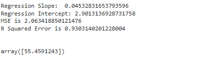

# Implementation-of-Multivariate-Linear-Regression-Model-for-Sales-Prediction

## AIM:
To write a program to implement the multivariate linear regression model for sales prediction.

## Equipments Required:
1. Hardware – PCs
2. Anaconda – Python 3.7 Installation / Moodle-Code Runner

## Algorithm
### Step 1:
Import the required standard libraries such as pandas, matplotlib.pyplot for the implementation of the multivariate linear regression model for sales prediction.

### Step 2:
Upload the dataset and check for any null value in the values provided using the .isnull() function.

### Step 3:
Declare X and Y variables with respect to the dataset values given by the 'Advertising.csv' file.

### Step 4:
Predict the values by assigning a variable called y_pred.

### Step 5:
Using the Mean Square Error (MSE) find the required straight line that fits the data.

### Step 6:
Print the Mean Square Error(MSE) and R square error.

### Step 7:
End of the program.

## Program:
```
/*
Program to implement the multivariate linear regression model for sales prediction.
Developed by: SRIJITH R
RegisterNumber: 212221240054
*/


import pandas as pd
import matplotlib.pyplot as plt
df = pd.read_csv('Advertising_data.csv')
df.head()
df.describe()
df.isnull().sum()
x = df[['TV','Radio','Newspaper']]
y = df["Sales"]
from sklearn.model_selection import train_test_split
x_train, x_test,y_train,y_test = train_test_split(x,y,test_size=0.2, random_state=101)
from sklearn.linear_model import LinearRegression
l = LinearRegression()
l.fit(x_train,y_train)
y_pred = l.predict(x_test)
print("Regression Slope: ",l.coef_[0])
print("Regression Intercept:",l.intercept_)
from sklearn import metrics
MSE = metrics.mean_squared_error(y_test,y_pred)
print("MSE is {}".format(MSE))
r2 = metrics.r2_score(y_test,y_pred)
print("R Squared Error is {} ".format(r2))
l.predict([[150.3,240.5,234.5]])

```

## Output:



## Result:
Thus the program to implement the multivariate linear regression model for sales prediction is written and verified using python programming.
